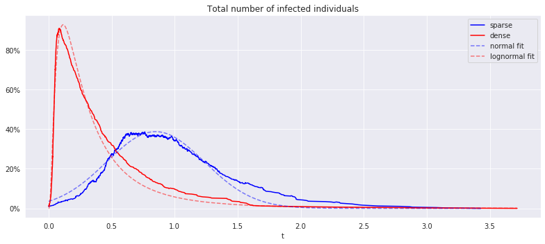
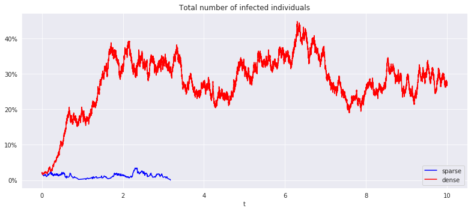

# markov_epidemic

Markov stochastic models to describe the evolution of epidemics on a network of connected individuals.

This repo contains standalone code for simulating epidemics and study the influence of the underlying graph and points to some theoretical results regarding the expected lifetime of an epidemic as a function of its infection/recovery rates and the network topology (in particular its adjacency spectrum).

Enjoy while you stay indoors helping us reduce our spectral radius :) 

**To install** : clone repo and pip install -e markov_epidemic/

**To run the app** : run bokeh serve --show markov_epidemic_app/

### Susceptible-Infected-Removed (SIR)

### Susceptible-Infected-Susceptible (SIS)

